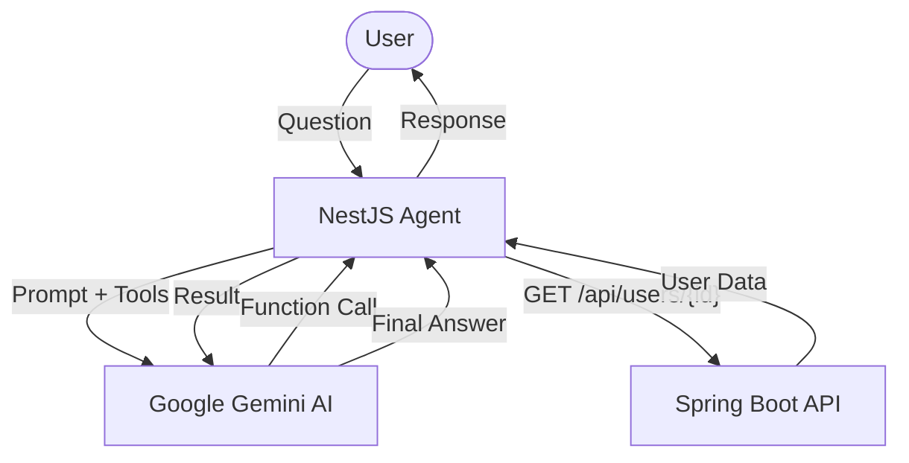

# AI Agent Microservice (NestJS + Google Gemini)

Microservice built with **NestJS** that acts as an intelligent agent. It leverages **Google Gemini AI** with **Function Calling** capabilities to interact with external systems in real-time.

## 🚀 Overview

The agent is designed to bridge the gap between Large Language Models and your core business logic. When a user asks a question that requires live data, the agent can decide to call specific functions to fetch that data from a **Spring Boot** backend.

## Architecture

This diagram shows the interaction between the user, the NestJS agent, Google Gemini, and the Spring Boot API.



## ✨ Key Features

- **Intelligent Orchestration**: Powered by Google Gemini.
- **Real-time Function Calling**: Automatically executes internal logic based on user intent (e.g., retrieving user details).
- **External API Integration**: Seamlessly connects to a Java/Spring Boot backend via modular HTTP services.
- **Environment Driven**: Fully configurable via environment variables.

## 🛠 Prerequisites

- **Node.js**: v18 or higher.
- **Gemini API Key**: From [Google AI Studio](https://aistudio.google.com/).
- **Spring Boot API**: The agent expects a running backend service (default: `http://localhost:8080`).

### Expected API Endpoints

The agent currently integrates with:
- `GET /api/users/{id}`: Fetches detailed information about a specific user.
  - **Example Response**: `{ "id": "uuid", "name": "John Doe", "email": "john@example.com" }`

## ⚙️ Configuration

Create a `.env` file in the root directory:

```env
GEMINI_API_KEY=your_api_key_here
```

## 📦 Quick Start

1. **Install dependencies**:
   ```bash
   npm install
   ```

2. **Run in development**:
   ```bash
   npm run start:dev
   ```

## 💬 How it works

When a user sends a message, the agent follows this flow:
1. **Intent Analysis**: Gemini determines if it needs more information to answer correctly.
2. **Action**: If needed, it triggers the `getUserInfoById` tool.
3. **External Call**: NestJS calls your Spring Boot API and gets the raw data.
4. **Synthesis**: Gemini processes the raw data and provides a natural language response to the user.

---
*Built with NestJS and Google Gemini AI.*
